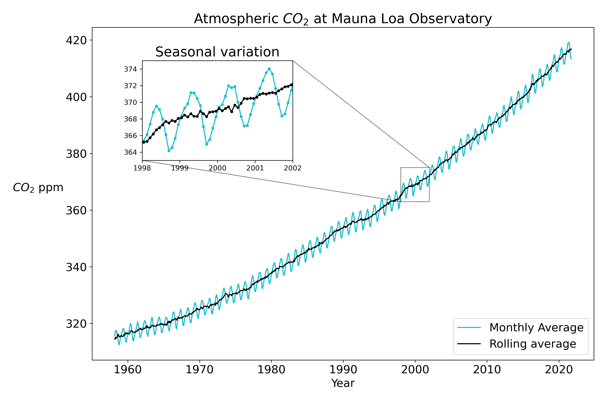

# data-science-demos

Set of demos for datascience tools applied to a the Mauna Loa CO2 dataset from [here](https://gml.noaa.gov/ccgg/trends/). The `interp` folder uses a random train-test split and tests different regression models for interpolation. The `extrap` folder uses a continuous subset of data points (those between 1970 and 2000) and tests different regression models for extrapolation.

## Talking points
1. Models that are good for interpolation may not be good outside the training domain.
2. Higher-order models aren't always better.
3. There are many ways to implement models for data science, each with their own relative advantages.
4. DO NOT USE THE NORMAL EQUATIONS TO IMPLEMENT REGRESSION!
