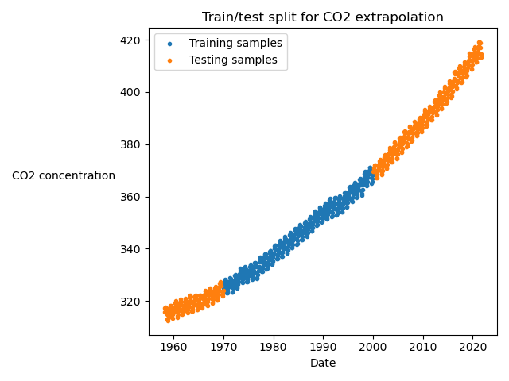

# Extrapolation

This folder contains the same models as the Interpolation folder, but applied to a different dataset. The question we wish to answer here is:

> Given many data points within an interval, can we create a model that is accurate outside of that interval?

