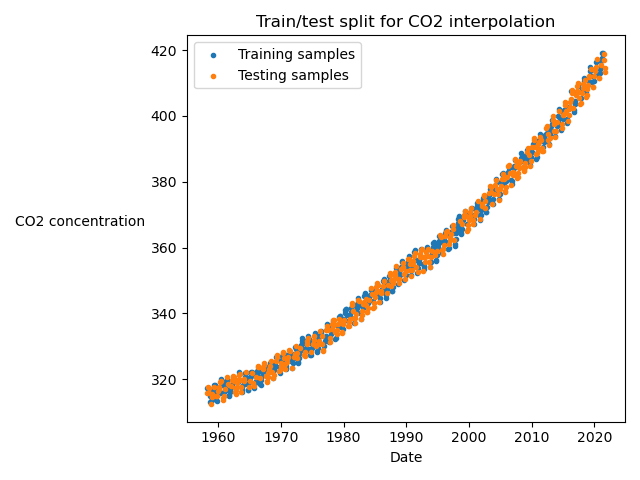

# Interpolation

This folder contains a set of Regression models for interpolating CO2 data points. Models tested include:

- Linear regression
- Polynomial regression
- Gaussian process regression
- Custom curve regression (polynomial + sinusoidal)

The question we wish to answer here is:

> Given a subset of data points ((X, y) pairs) inside of some interval, can we predict the true y-values anywhere inside that interval?

